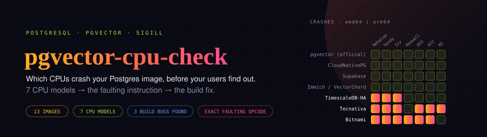
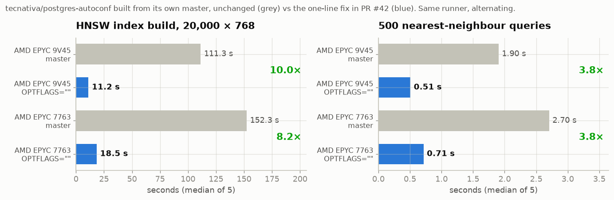
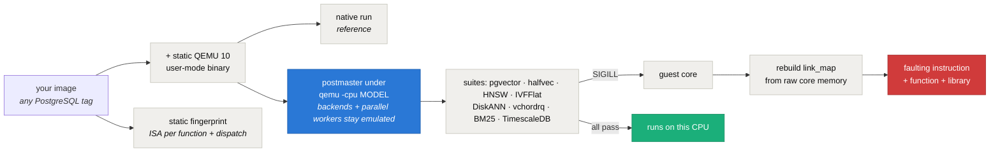

<div align="center">



# pgvector-cpu-check — which CPUs crash your PostgreSQL / pgvector Docker image

**Replays your image on 7 CPU models, from a 2008 Nehalem to a Raspberry Pi and AWS Graviton2, names the exact instruction that kills PostgreSQL with `Illegal instruction`, and points at the one-line build fix. 13 popular images audited, 3 build bugs found.**

[](https://github.com/intikhab49/pgvector-cpu-check/actions/workflows/action-test.yml)
[](https://github.com/intikhab49/pgvector-cpu-check/releases/latest)
[](https://github.com/marketplace/actions/pgvector-cpu-check)
[](#how-it-works)
[](LICENSE)
[](https://intikhab49.github.io/pgvector-cpu-check/)

[Results](#results-october-2026) · [Faulting instructions](#what-crashes-exactly) · [Use in CI](#check-your-own-image-in-ci) · [Fix your build](#how-to-fix-a-build) · [How it works](#how-it-works) · [FAQ](#faq)

</div>

---

## What this is

**`server process was terminated by signal 4: Illegal instruction`**. If PostgreSQL dies like this right after
`CREATE EXTENSION vector`, an insert, or `CREATE INDEX ... USING hnsw`, the image you run was compiled for a newer
CPU than the one under it. This repository finds out **which CPUs an image runs on, before your users do**, and
names the exact machine instruction, function and library that crashes.

It is a GitHub Action, a set of scripts, and a weekly audit of popular PostgreSQL vector images
(pgvector, pgvectorscale, VectorChord, pgvecto.rs, ParadeDB `pg_search`, TimescaleDB) on amd64 and arm64.

## Results (October 2026)

Each image runs the real PostgreSQL server natively and on emulated CPUs: **Nehalem** (SSE4.2, no AVX),
**Sandy Bridge** (AVX), **Ivy Bridge** (AVX + F16C), **Haswell** (AVX2 + FMA, no AVX-512); on arm64
**Cortex-A53 / A72** (Raspberry Pi 3 / 4, ARMv8.0) and **Neoverse N1** (AWS Graviton2, Ampere Altra).


| Image (digest checked) | Extensions | amd64 | arm64 |
|---|---|---|---|
| `pgvector/pgvector:pg17-trixie`, `:pg18-trixie` | pgvector 0.8.7 | ✅ every CPU | ✅ every CPU |
| `ghcr.io/cloudnative-pg/postgresql:17-standard-trixie` | pgvector 0.8.6 | ✅ every CPU | ✅ every CPU |
| `supabase/postgres:17.11.0.004` | pgvector 0.8.2 | ✅ every CPU | ✅ every CPU |
| `paradedb/paradedb:0.26.0-pg18` | pgvector 0.8.6, pg_search 0.26.0 | ✅ every CPU | ✅ every CPU |
| `ghcr.io/immich-app/postgres:14-vectorchord0.4.3-pgvectors0.2.0` (Immich default) | VectorChord 0.4.3, pgvecto.rs 0.2.0, pgvector 0.8.1 | ✅ every CPU | ✅ every CPU |
| `ghcr.io/immich-app/postgres:17-vectorchord1.1.1-pgvector0.8.5` | VectorChord 1.1.1, pgvector 0.8.5 | ✅ every CPU | ✅ every CPU |
| `tensorchord/vchord-postgres:pg17-v1.1.1` | VectorChord 1.1.1, pgvector 0.8.2 | ✅ every CPU | ✅ every CPU |
| `ankane/pgvector:latest` (frozen 2023) | pgvector 0.5.1 | ✅ every CPU | ✅ every CPU |
| `ghcr.io/intikhab49/lifeboat/postgresql:18` ¹ | pgvector 0.8.7 | ✅ every CPU | ✅ every CPU |
| `timescale/timescaledb-ha:pg17.11-ts2.30.2` | **pgvectorscale 0.9.1**, pgvector, VectorChord 0.5.3, pgvecto.rs 0.4.0, TimescaleDB 2.30.2 | ❌ **pgvectorscale** below Haswell (everything else ✅) | ✅ every CPU |
| `bitnami/postgresql:latest` (`sha256:ea7edc281ba9…`) | pgvector 0.8.7 | ❌ **every CPU without AVX-512**, including real AMD EPYC 7763 servers | ❌ Raspberry Pi 3 / 4 |
| `tecnativa/postgres-autoconf:18-alpine` | pgvector 0.8.1 | ❌ below Haswell | ❌ **every ARM CPU without SVE**: Raspberry Pi, Graviton2, Ampere Altra |

¹ lifeboat is by the same author as this repository.

Full per-suite tables, faulting instructions and digests: [the latest audit run](https://github.com/intikhab49/pgvector-cpu-check/actions/workflows/audit.yml)
(job summary) and [the write-up](https://intikhab49.github.io/pgvector-cpu-check/).

### What crashes, exactly

| Image | CPU | Faulting instruction | Where | Cause |
|---|---|---|---|---|
| Bitnami amd64 | any without AVX-512 | `vpermt2d 0x20(%rdi,%rax,2),%ymm2,%ymm0` (AVX-512VL) | `array_to_vector` in `vector.so` — every insert of an array | pgvector built with its default `-march=native` on an AVX-512 machine |
| Bitnami arm64 | Cortex-A53/A72 | `fabs h1, h2` (FP16 arithmetic, ARMv8.2) | `vector_to_halfvec` | same, on an ARMv8.2+ build machine |
| Tecnativa amd64 | Ivy Bridge, Sandy Bridge, Nehalem | `shlx` (BMI2), `vcvtps2ph` (F16C), VEX `vmovsd` (AVX) | `binary_quantize`, `Float4ToHalfUnchecked`, `HnswInit` | `make CFLAGS=-march=x86-64-v2` is overridden by pgvector's later `-march=native` |
| Tecnativa arm64 | A53, A72, **Neoverse N1** | `cntd x4` (**SVE**) | `array_to_vector` | arm64 built under QEMU emulation with `-march=native` = QEMU's "max" CPU, which has SVE |
| pgvectorscale 0.9.1 (TimescaleDB-HA) | Sandy Bridge, Ivy Bridge | `vinserti128` (AVX2) | `foldhash::seed::global::GlobalSeed::init_slow` — Rust's hash-map seed, not vector code | `-Ctarget-feature=+avx2,+fma` for the whole crate |
| pgvectorscale 0.9.1 | Nehalem | VEX `vxorps` | pgrx FFI glue for `add_reloption_kind` in `_PG_init` | same |

pgvectorscale has a guard meant to turn a missing AVX2/FMA into a clean error
(`is_x86_feature_detected!("avx2")` in `_PG_init`). Compiled with `+avx2,+fma`, that macro is a compile-time `true`,
so the check is removed: the panic message is absent from the released `vectorscale-0.9.1.so`, and the server
crashes instead.

### Reported upstream

- Tecnativa `postgres-autoconf`: [pull request #42](https://github.com/Tecnativa/docker-postgres-autoconf/pull/42), a one-line fix (`make OPTFLAGS=""`).
  With it the image runs on every CPU model above, and pgvector is built with `-O2` again: HNSW index builds
  **8 to 10 times faster** and queries **3.8 times faster** on the same runner
  ([evidence run](https://github.com/intikhab49/pgvector-cpu-check/actions/runs/37425193526)).
- pgvectorscale: [issue #288](https://github.com/timescale/pgvectorscale/issues/288), the compiled-out CPU check.



## Check your own image in CI

```yaml
- uses: intikhab49/pgvector-cpu-check@v1
  with:
    image: ghcr.io/you/your-postgres:17   # any PostgreSQL image; pgvector, VectorChord, pgvectorscale, pg_search, TimescaleDB are exercised when present
    platforms: amd64 arm64
```

Checking an image you just built (no push needed):

```yaml
- uses: docker/setup-buildx-action@v4
- run: docker buildx build --platform linux/amd64 --load -t local/pg:test .
- uses: intikhab49/pgvector-cpu-check@v1
  with:
    image: local/pg:test
    platforms: amd64
    local-image: "true"
```

The step fails when any CPU model crashes (`fail-on-crash: "false"` to only report), writes the full table to the job
summary, and sets the outputs `crashed` and `report`.

Locally (Linux, Docker): `bash scripts/probe.sh pgvector/pgvector:pg17 amd64 out/ && cat out/results.tsv`.

## How to fix a build

- **pgvector from source**: `make OPTFLAGS=""`. Do not pass `CFLAGS=...`: it replaces PostgreSQL's own CFLAGS,
  dropping `-O2`, `-fwrapv` and `-fno-strict-aliasing`, and pgvector's `-march=native` still comes after it.
  pgvector's own image, the PostgreSQL apt packages (Debian's `no-native` patch) and Nix builds are already portable.
- **Building arm64 under QEMU** (`docker buildx --platform linux/arm64` on an amd64 runner): `-march=native` and
  `-mcpu=native` mean QEMU's emulated "max" CPU there, with SVE and every other optional feature.
- **Rust (pgrx) extensions**: a global `-C target-feature=+avx2` or `target-cpu=...` puts those instructions into
  dependency code (hashing, FFI glue), and makes `is_x86_feature_detected!` constant-true. Keep the global target
  generic and use `#[target_feature(enable = "...")]` kernels chosen at runtime, as VectorChord does.

## How it works



1. **Dynamic.** A static QEMU 10 user-mode binary is layered into the image. The real postmaster runs under
   `qemu -cpu <model>`; every backend and parallel worker it forks stays on the emulated CPU. Each suite
   (pgvector core, pgvector 0.7+ halfvec/sparsevec/bit, pgvectorscale DiskANN, VectorChord vchordrq, pgvecto.rs,
   pg_search BM25, TimescaleDB compression) runs natively first, then on every model, with HNSW, IVFFlat and
   parallel index builds.
2. **Crash analysis.** QEMU writes the guest's core on SIGILL. Its cores lack the file-mapping note gdb uses, so
   `scripts/corelibs.py` rebuilds the dynamic loader's `link_map` from raw core memory (each entry checked against the
   library's real `.dynamic` address), places the executable from the auxiliary vector, falls back to segment layout
   for libraries whose entry was cut off, and disassembles the faulting instruction from the image's own files.
3. **Static fingerprint.** `scripts/fingerprint.py` classifies every function's instructions (AVX, AVX2, AVX-512, FMA,
   F16C, BMI; SVE, FP16, dot product, LSE on arm64) and looks for runtime-dispatch machinery (cpuid, IFUNC, Rust
   `std_detect`, HWCAP). It is calibrated against the dynamic results and agrees with them on all 28 image/arch pairs.

Limits: QEMU does not emulate AVX-512, so "needs AVX-512" shows up as a crash on the Haswell model (and natively on
runners without it). arm64 "native" is QEMU's `max` CPU because the runners are amd64.

## FAQ

**Why does PostgreSQL crash with "Illegal instruction" after installing pgvector?**
The `vector.so` in your image was compiled with `-march=native` (pgvector's default) on a machine with newer
instructions than yours. Use an image built with `OPTFLAGS=""`, such as `pgvector/pgvector`, or rebuild.

**It works on my laptop but crashes on the server / in a VM.**
Hypervisors often hide AVX-512 or AVX2 (Proxmox's default `kvm64`/`x86-64-v2-AES` CPU types, some cloud VM
families). In this audit, Bitnami's image passed on an AMD EPYC 9V74 runner that exposed AVX-512 and crashed on the
same CPU model when the VM hid it.

**Does it work on a Raspberry Pi or AWS Graviton2?**
See the arm64 column: Cortex-A53/A72 are Raspberry Pi 3/4, Neoverse N1 is Graviton2 / Ampere Altra.

**Can I add an image?** Open an [image request](../../issues/new?template=audit-an-image.yml).

## License

MIT for this repository's files. The images tested belong to their publishers; nothing here is affiliated with
pgvector, Bitnami/Broadcom, Timescale, Tecnativa, Supabase, ParadeDB, TensorChord, Immich or CloudNativePG.
